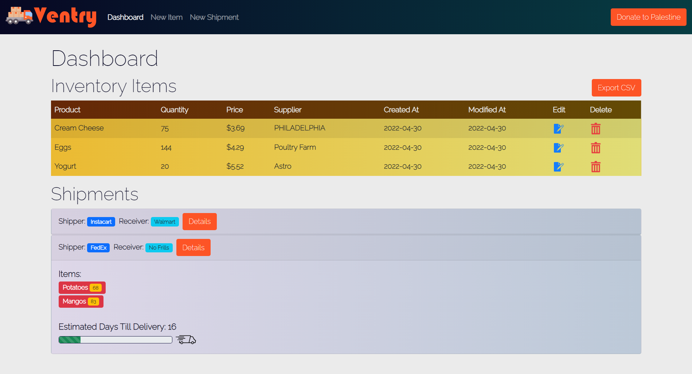

<p align="center">
    
</p>

# Overview

Ventry is an inventory tracking [CRUD](https://en.wikipedia.org/wiki/Create,_read,_update_and_delete) application built using [Go](https://go.dev/) and [PostgreSQL](https://www.postgresql.org/).

## Dashboard

The dashboard page shows all items in the current inventory.



## Create New Items

New items can be created by navigating to the **New Item** link on the navbar and filling out the form with the item details.


## Update Existing Items

Existing items can be updated by clicking the edit icon on the right hand side of the corresponding item on the dashboard and filling out the pre-populated form with the appropriate changes.


## Exporting to CSV

Ventry can also export the inventory data into [CSV](https://en.wikipedia.org/wiki/Comma-separated_values) format. This can be done by clicking the **Export CSV** button on the dashboard.


# Getting Started

## Running Ventry using Docker Compose (Recommended)

:one: Install Docker from the [official website](https://www.docker.com/). Installation instructions may vary depending on the OS.

:two: Run Docker.

```bash
docker compose up
```

Once the logs print `database system is ready to accept connections`, Ventry will be up on `http://localhost:8000/`.

## Running Ventry using Go & PostgreSQL

:one: Install Go from the [official website](https://go.dev/). Installation instructions may vary depending on the OS.

:two: Install PostgreSQL from the [official website](https://www.postgresql.org/). Installation instructions may vary depending on the OS.

:three: Set environment variables.

```bash
export VENTRY_POSTGRES_DATABASE="ventrydb"
export VENTRY_POSTGRES_USERNAME="<postgres username>"
export VENTRY_POSTGRES_PASSWORD="<postgres password>"
export VENTRY_POSTGRES_HOST="localhost"
export VENTRY_POSTGRES_PORT="5432"
```

Note that `VENTRY_POSTGRES_USERNAME` and `VENTRY_POSTGRES_PASSWORD` must correspond to the username and passwords of the PostgreSQL instance running respectively.

:four: Set up database.

Run the SQL query scripts in `db/` to create the database and table.

```bash
psql -U <postgres username> -d ventrydb -a -f db/create_database.sql
psql -U <postgres username> -d ventrydb -a -f db/create_table.sql
psql -U <postgres username> -d ventrydb -a -f db/insert_sample.sql
```

:five: Install Go dependencies.

```bash
go install
```

:six: Run Go server.

```bash
go run .
```

This should run the Ventry web app on `http://localhost:8000/`.
